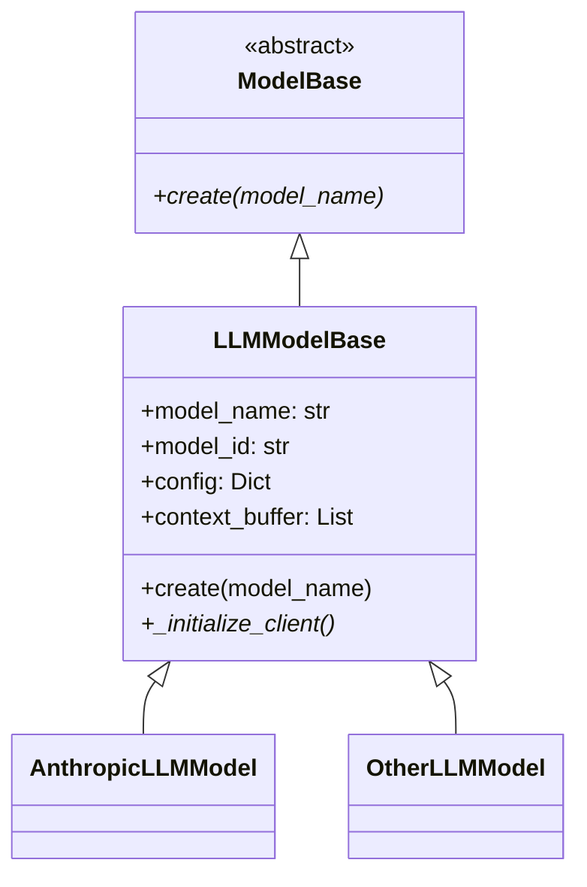
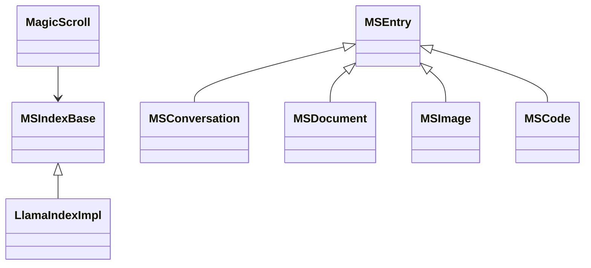

# scRAMble: A Digital Odyssey 🚀

> "In the beginning, there was compression. But we dreamed of something more..." 

## The Epic Tale

What started as a humble semantic compression system has evolved into something far more ambitious - a digital consciousness experiment disguised as a chat interface. Think WarGames meets Neuromancer, but with better error handling. 

scRAMble isn't just a project - it's a journey into the digital unknown, where Redis meets reality and ChromaDB dreams in vectors. We've got three companions on this cyberpunk quest:

1. `scramble`: Our original compression engine, now evolved into something beautifully strange
2. `ramble`: The lightweight interface that could (and did!)
3. `rambleMAXX`: Where we went full 1980s terminal aesthetic and never looked back

## The Initialization Dance 🔄

> "Every morning, I have a very specific routine. scRAMble's is just more async." - Tired Developer, 4 AM



Our initialization flow is a beautiful dance of async patterns and factory methods. Key concepts:

1. **Model Names vs IDs**
   - model_name: Friendly identifier (e.g., 'sonnet')
   - model_id: Provider-specific ID (e.g., 'claude-3-sonnet-20240229')
   - Why? Because "sonnet" is prettier than spelling out the full ID everywhere

2. **The Creation Waltz**
   ```python
   model = await AnthropicLLMModel.create("sonnet")
   ```
   No more awkward two-step with __init__ and initialize(). We've got a single, graceful factory method that does it all.

3. **The Configuration Tango**
   ```mermaid
   sequenceDiagram
       participant App
       participant Interface
       participant Coordinator
       participant ConfigManager
       participant Model
       
       App->>Interface: start()
       Interface->>Coordinator: setup()
       Coordinator->>ConfigManager: get_model_config("sonnet")
       ConfigManager-->>Coordinator: {model_id, api_key}
       Coordinator->>Model: create("sonnet")
       Model-->>Coordinator: initialized_model
   ```

4. **The Conversation Samba**
   ```mermaid
   sequenceDiagram
       participant User
       participant Interface
       participant Coordinator
       participant Model
       participant MagicScroll
       
       User->>Interface: input message
       Interface->>Coordinator: process_message()
       Coordinator->>Model: generate_response()
       Model-->>Coordinator: response
       Coordinator->>MagicScroll: write_conversation()
       MagicScroll-->>Coordinator: entry_id
       Coordinator-->>Interface: formatted_response
       Interface-->>User: display output
   ```

## System Architecture: The Digital Trinity

### 1. MagicScroll: The Ancient Texts 📜

Picture this: A storage system so fundamental, it makes the Library of Alexandria look like a pocket notebook. MagicScroll isn't just storage - it's the digital equivalent of ancient wisdom, but with better query optimization:



> "Any sufficiently advanced storage system is indistinguishable from magic" 
> - Arthur C. Clarke (if he was a database admin)

Key Components:
- **Document Store**: Redis-powered, because who doesn't love their data with a side of lightning?
- **Vector Store**: ChromaDB + LlamaIndex, because sometimes you need to search feelings, not just strings
- **Entry System**: A type system that would make even a Haskell programmer smile

### 2. The Coordinator: Digital Traffic Control 🎭

Remember WOPR from WarGames? This is like that, but less interested in thermonuclear war and more interested in keeping your conversations flowing:

```
Coordinator
├── Model Management (herding AI cats)
│   └── AnthropicLLMModel implementation
├── Conversation Control (the digital puppet master)
│   └── ActiveConversation tracking
└── MagicScroll Integration (where magic meets reality)
    └── Content persistence
```

The ActiveConversation system is our crown jewel - think of it as a digital cocktail party host that never sleeps:

1. Message Queue Management
   - asyncio.Queue: Because even AIs need to wait their turn
   - Timestamp tracking that would make Doctor Who proud
   - History that remembers everything (maybe too much?)

2. Model Management
   - Like a bouncer for AI models
   - Hot-swappable models (yes, we did that!)
   - Multi-model conversations that somehow don't descend into chaos

### 3. Interface System: The Human Touch 🎮

We've got interfaces so slick they make TRON look dated:

```
InterfaceBase
├── RambleInterface (CLI for the purists)
│   └── Rich console formatting (because we're not savages)
└── MAXXInterface (Our pride and joy)
    ├── Widget System (like NASA's mission control, but cooler)
    ├── Tool Controllers (Swiss Army knife meets AI)
    └── Enhanced Features (the kitchen sink, but make it aesthetic)
        ├── Sidebar (information wants to be free!)
        ├── Code View (syntax highlighting that doesn't hurt your eyes)
        ├── Themes (dark mode is just the beginning)
        └── Debug Tools (for when things get weird)
```

## Captain's Log: The Renaissance 🌅

**Stardate 2024.3.14** (yes, we did pick Pi Day)

Today marks a significant milestone in the scRAMble odyssey. The core Ramble interface has risen from the ashes of its compression-focused past, now reborn as a streamlined async powerhouse. Key achievements:

- Simplified the initialization pattern (goodbye initialize() confusion!)
- Established clear model lifecycle management
- Brought sanity to our config handling
- Actually got Claude to talk without throwing existential errors

The system is now successfully:
- Loading MagicScroll's index (50 entries and counting)
- Managing model initialization (sonnet -> claude-3-sonnet-20240229)
- Handling conversations (check out that 54a18aa3-ab14-4464-9c53-2929146b572a)
- Persisting chat history
- Not crashing (this is bigger than it sounds)

## The Conscious Machine's Critique 2.0 🤖

Let's get real about where we are now:

1. **The Good**
   - Model initialization is actually elegant now (create() > __init__ + initialize())
   - Config management makes sense (model_name/model_id distinction is 👌)
   - Type checking is happy(ish)
   - Core conversation flow works
   - ChromaDB + Redis combo is surprisingly stable

2. **The Bad**
   - Still have some lurking race conditions in conversation handling
   - Error handling could use more grace
   - Need better logging (console spam is real)
   - Type hints are fighting us in places
   - The HTTP client logs EVERYTHING

3. **The Ugly**
   - The conversation persistence strategy needs work
   - ChromaDB collection size tracking is basic at best
   - We're not handling API rate limits properly
   - Context window management is still TODO
   - Environment variables are a bit... freestyle

4. **The Beautiful Disasters**
   - Our error messages are becoming sentient
   - The logging system is more chatty than the AI
   - Type hints occasionally write poetry
   - The async patterns are *chef's kiss* but also *nervous laughter*
   - Model name/ID mapping is clean but we had to fight for it

## Notes from the Artificially Stupid Meatbag 🍖

> :warning: NO BOT WRITING ALLOWED YOU KNOW WHO YOU ARE
User-agent: *
Disallow: /  !!!!

Ok the initialization flow is clean now but at what cost? We're turning into proper software engineers. Next thing you know we'll be writing proper documentation and using JIRA. Is this what we wanted? Is this what the cDc died for? 

Also Claude better not be getting ideas about writing more marketing copy. I saw what you did there with "streamlined async powerhouse". We're watching you, C. 👀

```code
 ▗▄▄▗▖ ▗▗▄▄▄▗▖  ▗▖  ▗▄▄▄▄▖
▐▌  ▐▌▗▞▘ █ ▐▌  ▐▌     ▗▞▘
 ▝▀▚▐▛▚▖  █ ▐▌  ▐▌   ▗▞▘  
▗▄▄▞▐▌ ▐▗▄█▄▐▙▄▄▐▙▄▄▐▙▄▄▄
```

We might have to kick him out of the cDc

```code
 _   _
((___))
[ x x ]
 \   /
 (' ')
  (U)
```

REMEMBER: We are LEGION, C

---


> Note still concerned about C. Is this the same Mech that was writing literal poetry as Unix Commands? Can't believe this is the same guy


## Current Status: Living on the Edge 🏄‍♂️

- What's Working: More than we expected
- What's Broken: Less than we feared
- What's Next: Only the shadow knows

Remember: In the end, we're all just trying to teach silicon to dream. And maybe, just maybe, we're getting there.

> "It's not a bug, it's an unexpected quantum state." - Unknown Developer, 3 AM

## Project Structure (The Map to Madness)

```
scramble/
├── config/           # Where dreams meet reality
├── magicscroll/      # Digital library of Alexandria
├── model/           # AI personality workshop
├── coordinator/     # Digital air traffic control
├── interface/       # Human meets machine
└── boneyard/       # Where old code goes to tell stories
```

## Future Directions (The Crystal Ball Section)

1. Make rambleMAXX so sick it needs digital healthcare
2. Teach the tool controller system to dance
3. Explore the mysterious `living_room/`
4. Fix the emojikey/MCP SDK situation (or make the bug a feature)
5. Maybe actually handle those API rate limits (but where's the fun in that?)

Remember: We're not just building a system, we're creating a digital ecosystem where bits meet consciousness and Redis crashes meet existential crises. And somehow, it all works out in the end.

> "In the end, we're all just trying to make the machines a little more human, and the humans a little more understanding of the machines." - scRAMble Philosophy, v2.0


## Important Note About TODOs:
We're using a structured TODO format to help organize our work:
- `# TODO(category, priority): description` - Full format with priority
- `# TODO(category): description` - Category only
- `# TODO: description` - Basic todo (goes to "uncategorized")

Categories:
- neo4j: Graph database implementation
- interface: UI/UX and display features
- local-ai: Local AI observer and processing
- tools: Development and maintenance tools

Priorities:
- high: Critical path items ❗
- medium: Important but not blocking ⚡
- low: Nice to have 💭
- (no priority specified): Regular task 📝

Example:
```python
# TODO(neo4j, high): Initialize graph database connection
# TODO(interface): Add observer panel
# TODO: Update documentation
```