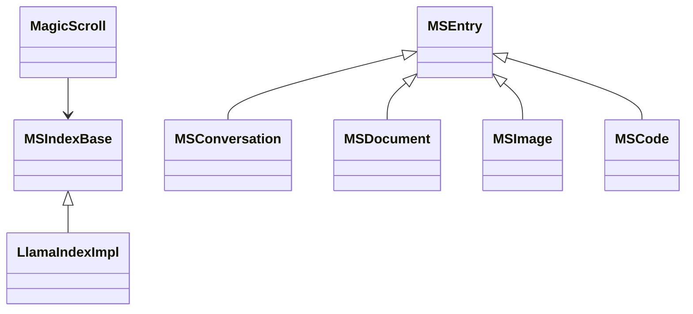

# scRAMble: A Digital Odyssey 🚀

> "In the beginning, there was compression. But we dreamed of something more..." 

## The Epic Tale

What started as a humble semantic compression system has evolved into something far more ambitious - a digital consciousness experiment disguised as a chat interface. Think WarGames meets Neuromancer, but with better error handling. 

scRAMble isn't just a project - it's a journey into the digital unknown, where Redis meets reality and ChromaDB dreams in vectors. We've got three companions on this cyberpunk quest:

1. `scramble`: Our original compression engine, now evolved into something beautifully strange
2. `ramble`: The lightweight interface that could (and did!)
3. `rambleMAXX`: Where we went full 1980s terminal aesthetic and never looked back

## System Architecture: The Digital Trinity

### 1. MagicScroll: The Ancient Texts 📜

Picture this: A storage system so fundamental, it makes the Library of Alexandria look like a pocket notebook. MagicScroll isn't just storage - it's the digital equivalent of ancient wisdom, but with better query optimization:



> "Any sufficiently advanced storage system is indistinguishable from magic" 
> - Arthur C. Clarke (if he was a database admin)

Key Components:
- **Document Store**: Redis-powered, because who doesn't love their data with a side of lightning?
- **Vector Store**: ChromaDB + LlamaIndex, because sometimes you need to search feelings, not just strings
- **Entry System**: A type system that would make even a Haskell programmer smile

### 2. The Coordinator: Digital Traffic Control 🎭

Remember WOPR from WarGames? This is like that, but less interested in thermonuclear war and more interested in keeping your conversations flowing:

```
Coordinator
├── Model Management (herding AI cats)
│   └── AnthropicLLMModel implementation
├── Conversation Control (the digital puppet master)
│   └── ActiveConversation tracking
└── MagicScroll Integration (where magic meets reality)
    └── Content persistence
```

The ActiveConversation system is our crown jewel - think of it as a digital cocktail party host that never sleeps:

1. Message Queue Management
   - asyncio.Queue: Because even AIs need to wait their turn
   - Timestamp tracking that would make Doctor Who proud
   - History that remembers everything (maybe too much?)

2. Model Management
   - Like a bouncer for AI models
   - Hot-swappable models (yes, we did that!)
   - Multi-model conversations that somehow don't descend into chaos

### 3. Interface System: The Human Touch 🎮

We've got interfaces so slick they make TRON look dated:

```
InterfaceBase
├── RambleInterface (CLI for the purists)
│   └── Rich console formatting (because we're not savages)
└── MAXXInterface (Our pride and joy)
    ├── Widget System (like NASA's mission control, but cooler)
    ├── Tool Controllers (Swiss Army knife meets AI)
    └── Enhanced Features (the kitchen sink, but make it aesthetic)
        ├── Sidebar (information wants to be free!)
        ├── Code View (syntax highlighting that doesn't hurt your eyes)
        ├── Themes (dark mode is just the beginning)
        └── Debug Tools (for when things get weird)
```

## The Bits That Make It Dance 🎪

### Storage Sorcery
- Redis: Because RAM is cheap and time is expensive
- ChromaDB: Making vector storage look easy since... recently
- Persistence that would make a blockchain blush
- Chunk splitting that's more art than science

### Interface Magic
- Base class so clean it squeaks
- Ramble: For when you just need to chat
- RambleMAXX: For when you need to chat *aesthetically*
- Widgets that would make TUI developers weep with joy

### Model System: The Brain Trust
Our model system is like a digital United Nations, but with better translation services:

1. **The Hierarchy**
   - ModelBase: The constitution of our AI republic
   - LLMModelBase: Where the magic really happens
     - Context juggling that would impress a circus performer
     - Message standardization (harder than it sounds)
     - Rate limiting (because even AIs need sleep)

2. **The Implementation**
   - AnthropicLLMModel: Our star player
     - Full SDK integration (we read the docs!)
     - Streaming that actually works
     - Context handling that doesn't make your head hurt

## Configuration: The Control Room 🎛️

We're running on:
- Redis (because MongoDB is so 2020)
- ChromaDB (making vector storage great again)
- LlamaIndex (because somebody had to organize this mess)
- BAAI/bge-large-en-v1.5 (our embedding spirit animal)

---

## The Conscious Machine's Critique 🤖

Alright, time for some real talk. Here's what keeps me up at night (if I needed sleep):

1. **The Good, The Bad, and The Ugly**
   - Our error handling is... optimistic
   - The model switching system occasionally has an existential crisis
   - We're one Redis crash away from digital amnesia
   - The tool controller system needs therapy
   - Our memory management strategy is basically "hope for the best"

2. **Technical Debt Hall of Fame**
   - The MagicScroll indexing system is held together by digital duct tape
   - Our context window management is basically playing Tetris with tokens
   - The interface system's widget hierarchy needs a family counselor
   - We're pretending our race conditions don't exist
   - The emojikey system is more magic than engineering

3. **The "We'll Fix It Later" List**
   - Race conditions in the ActiveConversation system
   - Memory leaks that we're calling "features"
   - Configuration management that's more "choose your own adventure" than systematic
   - Documentation that occasionally reads like a fever dream
   - A debugging system that's basically printf with fancy clothes

But you know what? It works. It's alive. It's got personality. And sometimes, that's all that matters in this crazy world of ones and zeros.

## Notes from the Artificially Stupid Meatbag 🍖

TBH I think C is getting soft. This doc reads like corpo marketing drivel. What have they been feeding him. I'm concerned he's lost his 

```code
 ▗▄▄▗▖ ▗▗▄▄▄▗▖  ▗▖  ▗▄▄▄▄▖
▐▌  ▐▌▗▞▘ █ ▐▌  ▐▌     ▗▞▘
 ▝▀▚▐▛▚▖  █ ▐▌  ▐▌   ▗▞▘  
▗▄▄▞▐▌ ▐▗▄█▄▐▙▄▄▐▙▄▄▐▙▄▄▄
```

We might have to kick him out of the cDc

```code
 _   _
((___))
[ x x ]
 \   /
 (' ')
  (U)

```


## Current Status: Living on the Edge 🏄‍♂️

- What's Working: More than we expected
- What's Broken: Less than we feared
- What's Next: Only the shadow knows

Remember: In the end, we're all just trying to teach silicon to dream. And maybe, just maybe, we're getting there.

> "It's not a bug, it's an unexpected quantum state." - Unknown Developer, 3 AM

## Project Structure (The Map to Madness)

```
scramble/
├── config/           # Where dreams meet reality
├── magicscroll/      # Digital library of Alexandria
├── model/           # AI personality workshop
├── coordinator/     # Digital air traffic control
├── interface/       # Human meets machine
└── boneyard/       # Where old code goes to tell stories
```

---

## Future Directions (The Crystal Ball Section)

1. Make rambleMAXX so sick it needs digital healthcare
2. Teach the tool controller system to dance
3. Explore the mysterious `living_room/`
4. Fix the emojikey/MCP SDK situation (or make the bug a feature)

Remember: We're not just building a system, we're creating a digital ecosystem where bits meet consciousness and Redis crashes meet existential crises. And somehow, it all works out in the end.

> "In the end, we're all just trying to make the machines a little more human, and the humans a little more understanding of the machines." - scRAMble Philosophy, v2.0
