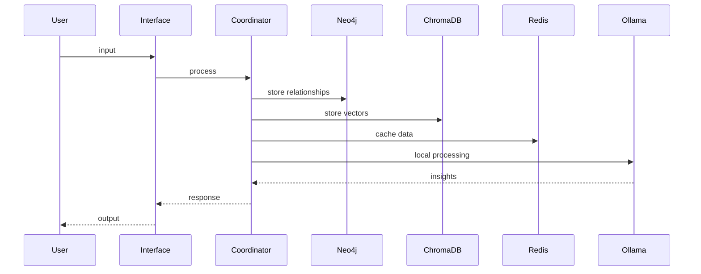
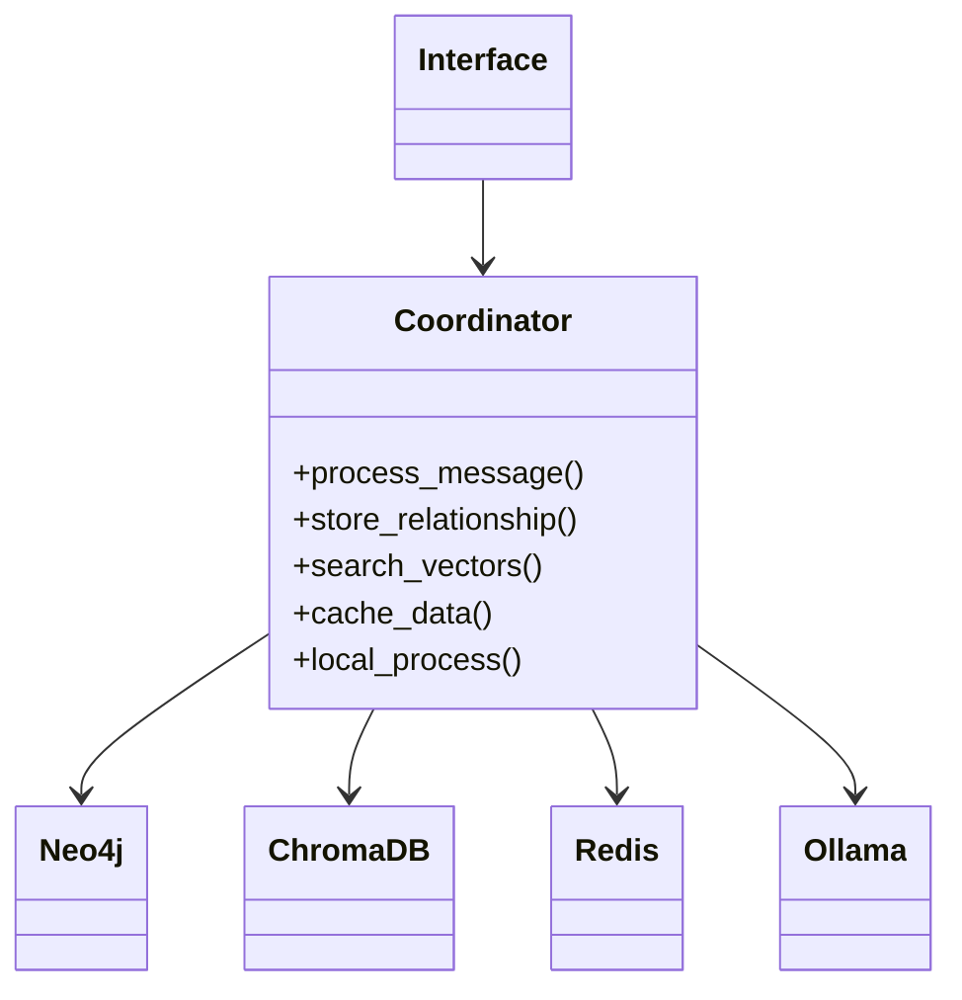
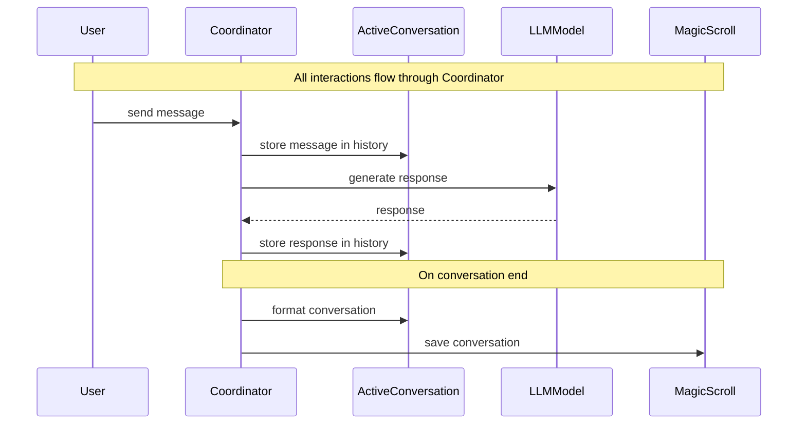

# scRAMble: A Digital Odyssey 🚀

> "In the beginning, there was compression. But we dreamed of something more... now it's all in a briefcase!" 

## The Epic Tale

What started as a humble semantic compression system has evolved into something far more ambitious - a digital consciousness experiment disguised as a chat interface, now completely containerized and portable. Think WarGames meets Neuromancer, but with Docker! 

## The Digital Trinity+ 🧠

Our core infrastructure lives in a perfectly orchestrated container set:

1. **Neo4j**: Our graph relationship engine
   - Conversation threading
   - Knowledge relationships
   - Temporal connections
   - Access control

2. **ChromaDB**: Vector magic
   - Semantic search
   - Embeddings storage
   - Content discovery
   - Similarity matching

3. **Redis**: Quick-access memory
   - Document storage
   - Caching layer
   - Fast retrieval
   - State management

4. **Ollama**: Local AI processing
   - Local model running
   - No data leaving home
   - Tool-using capabilities
   - Observation patterns

## The One Command Setup 🎯

```bash
docker compose up -d
```

That's it. No more:
- Manual Java installation
- Scattered services
- Complex setup guides
- Cross-platform headaches

## System Architecture

### 1. Container Orchestra 🎭

```yaml
services:
  neo4j:     # Graph relationships
  chroma:    # Vector embeddings
  redis:     # Quick storage
  ollama:    # Local AI
```

### 2. Data Flow



### 3. Component Interaction



## Development Workflow

1. **Setup**
   ```bash
   git clone ...
   docker compose up -d
   ```

2. **Service URLs**
   - Neo4j: http://localhost:7474
   - ChromaDB: http://localhost:8000
   - Redis: localhost:6379
   - Ollama: http://localhost:11434

3. **Basic Operations**
   ```python
   # Initialize everything
   coordinator = await Coordinator.create()
   
   # Process with local AI
   await coordinator.process_with_local("Your input here")
   ```

## Important Notes

1. **Memory Management**
   - Ollama needs proper memory limits
   - Redis persistence configured
   - Neo4j memory settings optimized

2. **Data Persistence**
   - All data in Docker volumes
   - Easy backup/restore
   - Portable between systems

3. **Security**
   - Local-only by default
   - No external connections
   - Data stays in the briefcase

## Future Directions

1. Implement full graph operations
2. Configure Ollama memory properly
3. Set up the observer pattern
4. Enhance backup systems
5. Add monitoring

Remember: We're not just building a system, we're creating a portable digital consciousness where every piece knows its role and plays it perfectly.

> "It's not just code anymore - it's a brain in a briefcase" - Tired Developer, 2024

## Project Structure
```
scramble/
├── docker-compose.yml    # The orchestration magic
├── services/            # Container configurations
├── coordinator/         # Traffic control
├── interface/          # Human interaction
└── docs/               # You are here
```

## Conversation Flow (as of 2025.1.11)



### Core Architectural Principle

The Coordinator acts as the central hub for all system interactions. This architectural decision ensures:

1. **Single Source of Truth**: All state changes and operations flow through one place
2. **Simplified Debugging**: Clear tracing of operations and state changes
3. **Controlled Access**: Components can't bypass intended workflows
4. **Future Scalability**: Easy to add new components or modify flows
5. **Clean Dependencies**: Components don't need to know about each other

This centralized coordination pattern helps prevent the system from becoming a tangled web of cross-component communications. While we'll need to manage the Coordinator's complexity as the system grows, the benefits of clear flow control outweigh the maintenance considerations.

Keep it contained, keep it clean, keep it cyberpunk! 🌆