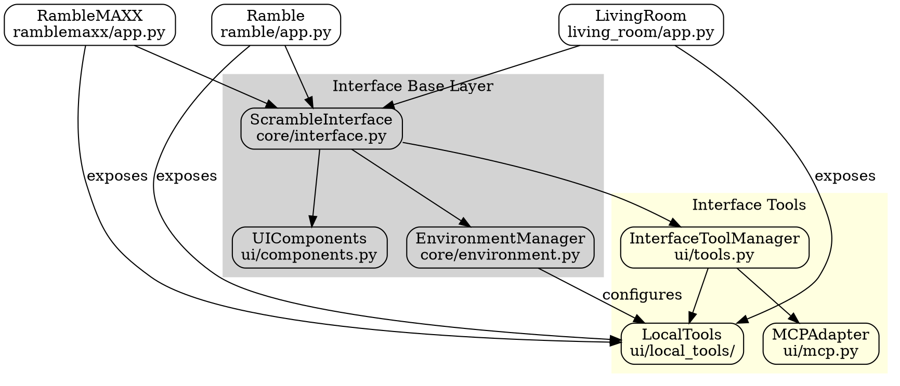

# Interface Cluster Architecture

Key aspects of this design:

1. **ScrambleInterface + UIComponents**: Base layer that provides:
   - Common display functions (time, prompts, etc)
   - Basic input handling
   - Core scroll interactions
   - Standardized component interfaces

2. **EnvironmentManager**: 
   - Manages interface capabilities configuration
   - Provides capability discovery for models
   - Handles environment variables and settings
   - Maps available UI components to tools

3. **InterfaceToolManager**:
   - Handles tool registration from interfaces
   - Manages tool lifecycles
   - Provides tool discovery
   - Abstracts MCP vs local implementation

4. Each interface app can:
   - Inherit common functionality
   - Expose specific capabilities as tools
   - Configure its environment
   - Extend base components

This design allows for:
- Code reuse through the base layer
- Flexible capability exposure
- Clean separation between interface and tools
- Easy porting of features between interfaces

Shall we refine this further? We could:
1. Detail specific UIComponents we want to share
2. Design the capability discovery system
3. Look at the tool registration flow
4. Something else?