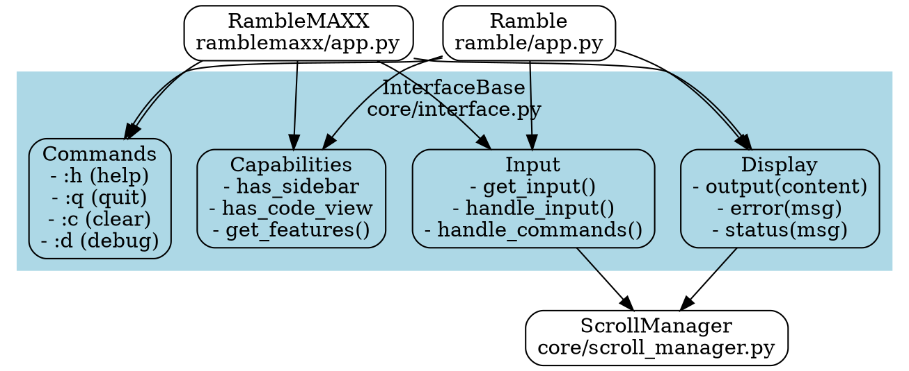

# Interface Architecture - InterfaceBase 

Common functionality I see between ramble and rambleMAXX:

1. **Display Functions**
   - Showing chat output
   - Displaying errors/status
   - Formatting timestamps
   - Showing prompts
   - Clear screen capability

2. **Input Handling**
   - Getting user input
   - Command processing
   - Input validation
   - History management

3. **Capability Reporting**
   - Available features (sidebar, code view, etc)
   - UI constraints
   - Tool availability 
   - Display capabilities

4. **Command Standards**
   - Help (:h)
   - Quit (:q)
   - Clear (:c)
   - Debug toggle (:d)
   - Theme cycling (in rambleMAXX but could be conditional)

5. **Common Patterns** 
   - Async operation
   - Error handling
   - Graceful shutdown
   - Configuration loading
   - Status/feedback to user

The key insight seems to be that InterfaceBase isn't managing multiple apps, but rather providing a foundational set of capabilities that any scramble interface needs, while letting each interface implement those capabilities in its own way.

Does this better capture what InterfaceBase should be? Are there other common patterns between the interfaces that I missed?