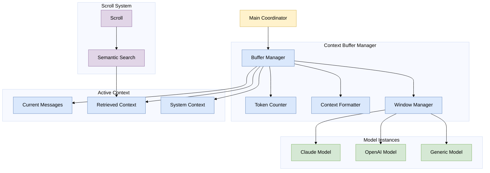

```mermaid
%%{init: { 'theme': 'base', 'themeVariables': { 'fontFamily': 'arial', 'fontSize': '16px', 'primaryTextColor': '#000000' } }}%%
graph TB
    %% Styling
    classDef coordinator fill:#fff2cc,stroke:#d6b656,color:#000000
    classDef buffer fill:#dae8fc,stroke:#6c8ebf,color:#000000
    classDef model fill:#d5e8d4,stroke:#82b366,color:#000000
    classDef scroll fill:#e1d5e7,stroke:#9673a6,color:#000000

    %% Components
    MainCoord[Main Coordinator]:::coordinator
    
    subgraph buffer[Context Buffer Manager]
        direction TB
        BufferManager[Buffer Manager]:::buffer
        TokenCounter[Token Counter]:::buffer
        ContextFormatter[Context Formatter]:::buffer
        WindowManager[Window Manager]:::buffer
    end
    
    subgraph scroll[Scroll System]
        ScrollClass[Scroll]:::scroll
        SemanticSearch[Semantic Search]:::scroll
    end
    
    subgraph models[Model Instances]
        Claude[Claude Model]:::model
        OAI[OpenAI Model]:::model
        Generic[Generic Model]:::model
    end

    %% Current Context Components
    subgraph active[Active Context]
        CurrentBuffer[Current Messages]:::buffer
        RelevantContext[Retrieved Context]:::buffer
        SystemPrompt[System Context]:::buffer
    end

    %% Relationships
    MainCoord --> BufferManager
    BufferManager --> TokenCounter
    BufferManager --> ContextFormatter
    BufferManager --> WindowManager
    
    BufferManager --> CurrentBuffer
    BufferManager --> RelevantContext
    BufferManager --> SystemPrompt
    
    ScrollClass --> SemanticSearch
    SemanticSearch --> RelevantContext
    
    WindowManager --> Claude
    WindowManager --> OAI
    WindowManager --> Generic

    %% Labels
    click BufferManager "Manages overall context state" _blank
    click TokenCounter "Tracks token usage across different models" _blank
    click ContextFormatter "Formats context for each model type" _blank
    click WindowManager "Manages model-specific window limits" _blank
```