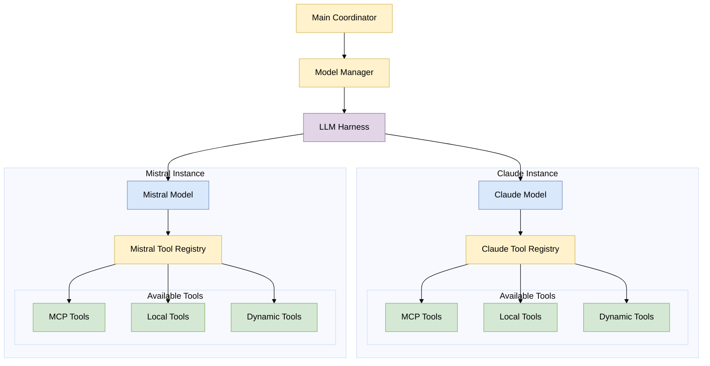

```mermaid
%%{init: { 'theme': 'base', 'themeVariables': { 'fontFamily': 'arial', 'fontSize': '16px', 'primaryTextColor': '#000000' } }}%%
graph TB
    %% Styling
    classDef coordinator fill:#fff2cc,stroke:#d6b656,color:#000000
    classDef model fill:#dae8fc,stroke:#6c8ebf,color:#000000
    classDef tool fill:#d5e8d4,stroke:#82b366,color:#000000
    classDef harness fill:#e1d5e7,stroke:#9673a6,color:#000000

    %% Main Coordinator Level
    MainCoord[Main Coordinator]:::coordinator
    
    %% Model Management Level
    ModelManager[Model Manager]:::coordinator
    
    %% LLM Harness Level
    LLMHarness[LLM Harness]:::harness
    
    %% Model Instances
    subgraph claude[Claude Instance]
        direction TB
        Claude[Claude Model]:::model
        ClaudeRegistry[Claude Tool Registry]:::coordinator
        subgraph claude_tools[Available Tools]
            ClaudeMCP[MCP Tools]:::tool
            ClaudeLocal[Local Tools]:::tool
            ClaudeDynamic[Dynamic Tools]:::tool
        end
    end
    
    subgraph mistral[Mistral Instance]
        direction TB
        Mistral[Mistral Model]:::model
        MistralRegistry[Mistral Tool Registry]:::coordinator
        subgraph mistral_tools[Available Tools]
            MistralMCP[MCP Tools]:::tool
            MistralLocal[Local Tools]:::tool
            MistralDynamic[Dynamic Tools]:::tool
        end
    end

    %% Relationships
    MainCoord --> ModelManager
    ModelManager --> LLMHarness
    LLMHarness --> Claude & Mistral
    Claude --> ClaudeRegistry
    ClaudeRegistry --> ClaudeMCP & ClaudeLocal & ClaudeDynamic
    Mistral --> MistralRegistry
    MistralRegistry --> MistralMCP & MistralLocal & MistralDynamic

    %% Labels
    click MainCoord "Coordinates models & scroll interactions" _blank
    click ModelManager "Manages model instances & configuration" _blank
    click LLMHarness "Provides unified interface to different models" _blank
    click ClaudeRegistry "Model-specific tool registry" _blank
    click MistralRegistry "Model-specific tool registry" _blank
```