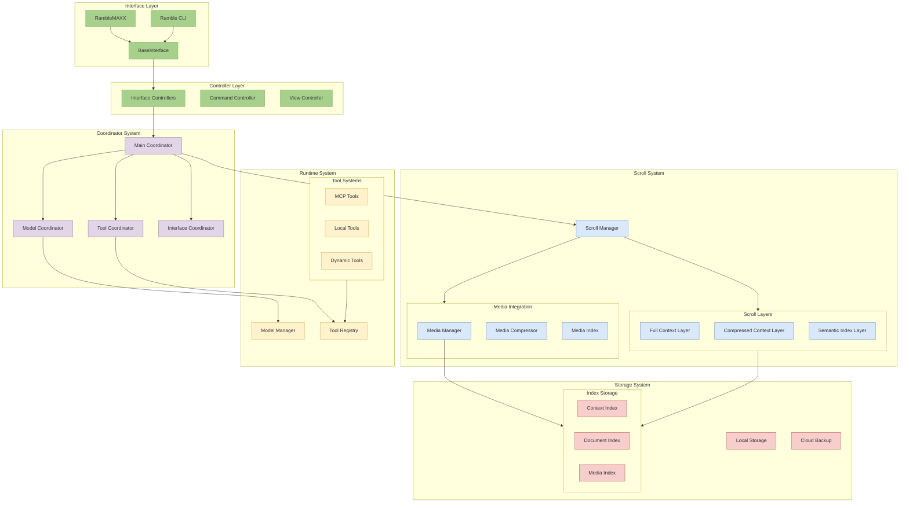

```mermaid
graph TB
    %% Styling
    classDef interface fill:#a8d08d,stroke:#82b366
    classDef coordinator fill:#e1d5e7,stroke:#9673a6
    classDef core fill:#dae8fc,stroke:#6c8ebf
    classDef storage fill:#f8cecc,stroke:#b85450
    classDef runtime fill:#fff2cc,stroke:#d6b656

    %% Interface Layer
    subgraph interfaces[Interface Layer]
        Maxx[RambleMAXX]:::interface
        Ramble[Ramble CLI]:::interface
        BaseInterface[BaseInterface]:::interface
    end

    %% Controller Layer
    subgraph controllers[Controller Layer]
        InterfaceControllers[Interface Controllers]:::interface
        CommandController[Command Controller]:::interface
        ViewController[View Controller]:::interface
    end

    %% Coordinator System
    subgraph coordinator[Coordinator System]
        MainCoordinator[Main Coordinator]:::coordinator
        ModelCoordinator[Model Coordinator]:::coordinator
        ToolCoordinator[Tool Coordinator]:::coordinator
        InterfaceCoordinator[Interface Coordinator]:::coordinator
    end

    %% Scroll System
    subgraph scroll[Scroll System]
        ScrollManager[Scroll Manager]:::core
        
        subgraph layers[Scroll Layers]
            direction TB
            FullContext[Full Context Layer]:::core
            CompressedContext[Compressed Context Layer]:::core
            SemanticIndex[Semantic Index Layer]:::core
        end
        
        subgraph media[Media Integration]
            MediaManager[Media Manager]:::core
            MediaCompressor[Media Compressor]:::core
            MediaIndex[Media Index]:::core
        end
    end

    %% Storage System
    subgraph storage[Storage System]
        LocalStore[Local Storage]:::storage
        CloudBackup[Cloud Backup]:::storage
        
        subgraph indexes[Index Storage]
            ContextIndex[Context Index]:::storage
            DocumentIndex[Document Index]:::storage
            MediaIndex2[Media Index]:::storage
        end
    end

    %% Runtime System
    subgraph runtime[Runtime System]
        ModelManager[Model Manager]:::runtime
        ToolRegistry[Tool Registry]:::runtime
        
        subgraph tools[Tool Systems]
            MCPTools[MCP Tools]:::runtime
            LocalTools[Local Tools]:::runtime
            DynamicTools[Dynamic Tools]:::runtime
        end
    end

    %% Relationships
    Maxx & Ramble --> BaseInterface
    BaseInterface --> InterfaceControllers
    InterfaceControllers --> MainCoordinator
    MainCoordinator --> ModelCoordinator & ToolCoordinator & InterfaceCoordinator
    MainCoordinator --> ScrollManager
    ScrollManager --> layers
    ScrollManager --> media
    MediaManager --> indexes
    layers --> indexes
    tools --> ToolRegistry
    ModelCoordinator --> ModelManager
    ToolCoordinator --> ToolRegistry
```