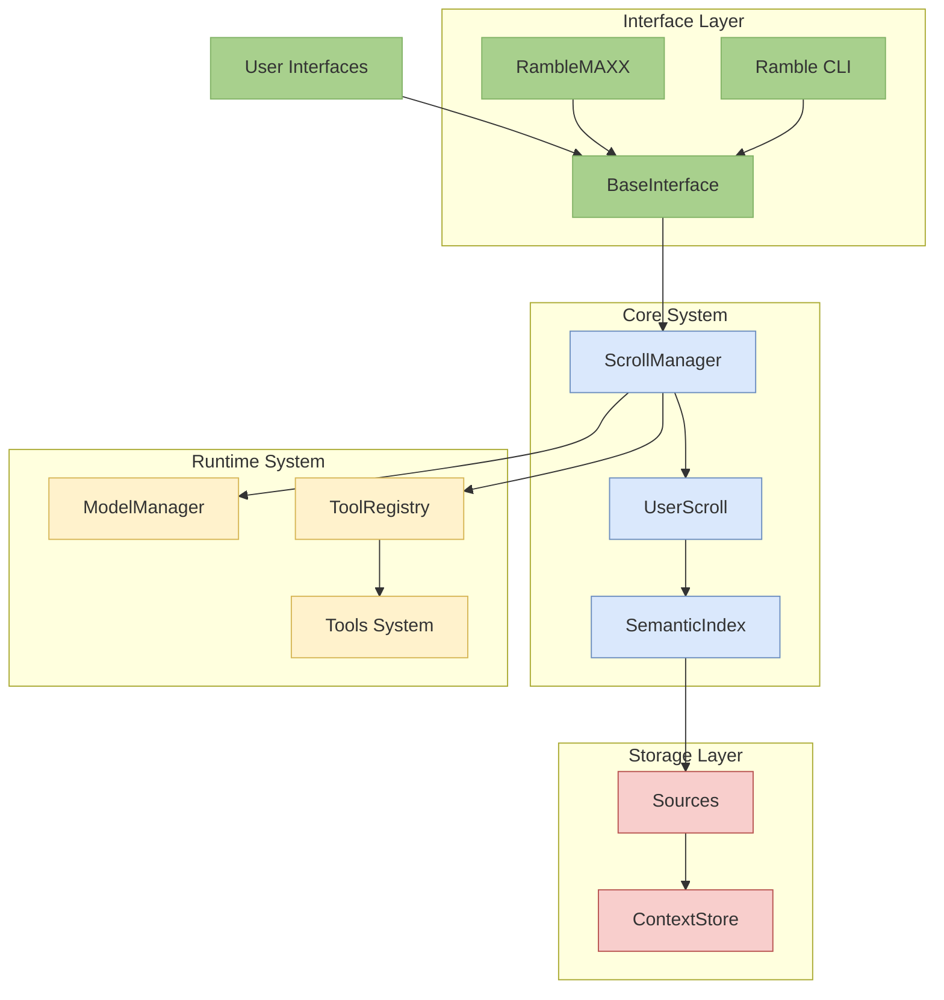

```mermaid
graph TB
    %% Styling
    classDef interface fill:#a8d08d,stroke:#82b366
    classDef core fill:#dae8fc,stroke:#6c8ebf
    classDef storage fill:#f8cecc,stroke:#b85450
    classDef runtime fill:#fff2cc,stroke:#d6b656

    %% Interface Layer
    UI[User Interfaces]:::interface
    subgraph interfaces[Interface Layer]
        Maxx[RambleMAXX]:::interface
        Ramble[Ramble CLI]:::interface
        BaseInterface[BaseInterface]:::interface
    end

    %% Core System
    subgraph core[Core System]
        ScrollManager[ScrollManager]:::core
        UserScroll[UserScroll]:::core
        SemanticIndex[SemanticIndex]:::core
    end

    %% Storage Layer
    subgraph storage[Storage Layer]
        ContextStore[ContextStore]:::storage
        Sources[Sources]:::storage
    end

    %% Runtime System
    subgraph runtime[Runtime System]
        ModelManager[ModelManager]:::runtime
        ToolRegistry[ToolRegistry]:::runtime
        Tools[Tools System]:::runtime
    end

    %% Relationships
    UI --> BaseInterface
    Maxx & Ramble --> BaseInterface
    BaseInterface --> ScrollManager
    ScrollManager --> UserScroll & ModelManager & ToolRegistry
    UserScroll --> SemanticIndex
    SemanticIndex --> Sources
    Sources --> ContextStore
    ToolRegistry --> Tools
```