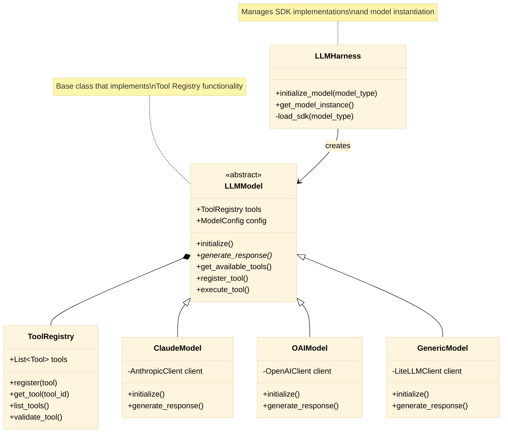

```mermaid
%%{init: { 'theme': 'base', 'themeVariables': { 'fontFamily': 'arial', 'fontSize': '16px', 'primaryTextColor': '#000000' } }}%%
classDiagram
    class LLMModel {
        <<abstract>>
        +ToolRegistry tools
        +ModelConfig config
        +initialize()
        +generate_response()*
        +get_available_tools()
        +register_tool()
        +execute_tool()
    }
    
    class ToolRegistry {
        +List~Tool~ tools
        +register(tool)
        +get_tool(tool_id)
        +list_tools()
        +validate_tool()
    }

    class ClaudeModel {
        -AnthropicClient client
        +initialize()
        +generate_response()
    }

    class OAIModel {
        -OpenAIClient client
        +initialize()
        +generate_response()
    }

    class GenericModel {
        -LiteLLMClient client
        +initialize()
        +generate_response()
    }

    class LLMHarness {
        +initialize_model(model_type)
        +get_model_instance()
        -load_sdk(model_type)
    }

    LLMModel *-- ToolRegistry
    LLMModel <|-- ClaudeModel
    LLMModel <|-- OAIModel
    LLMModel <|-- GenericModel
    LLMHarness --> LLMModel : creates

    note for LLMModel "Base class that implements\nTool Registry functionality"
    note for LLMHarness "Manages SDK implementations\nand model instantiation"
```