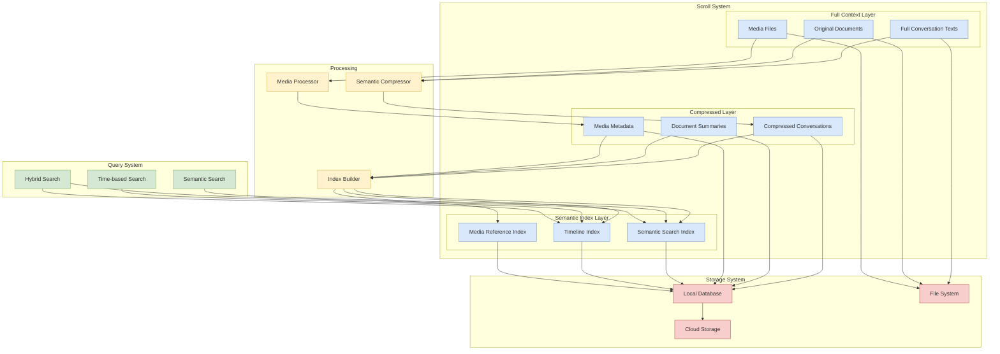

```mermaid
graph TB
    %% Styling
    classDef core fill:#dae8fc,stroke:#6c8ebf
    classDef storage fill:#f8cecc,stroke:#b85450
    classDef query fill:#d5e8d4,stroke:#82b366
    classDef process fill:#fff2cc,stroke:#d6b656

    %% Scroll Layers
    subgraph scroll[Scroll System]
        direction TB
        
        %% Full Context Layer
        subgraph full[Full Context Layer]
            FullContexts[Full Conversation Texts]:::core
            Documents[Original Documents]:::core
            Media[Media Files]:::core
        end
        
        %% Compressed Layer
        subgraph compressed[Compressed Layer]
            CompressedContexts[Compressed Conversations]:::core
            DocSummaries[Document Summaries]:::core
            MediaMetadata[Media Metadata]:::core
        end
        
        %% Index Layer
        subgraph index[Semantic Index Layer]
            SemanticIndex[Semantic Search Index]:::core
            TimelineIndex[Timeline Index]:::core
            MediaIndex[Media Reference Index]:::core
        end
    end

    %% Query System
    subgraph query[Query System]
        SemanticSearch[Semantic Search]:::query
        TimeSearch[Time-based Search]:::query
        HybridSearch[Hybrid Search]:::query
    end

    %% Processing
    subgraph processing[Processing]
        Compressor[Semantic Compressor]:::process
        IndexBuilder[Index Builder]:::process
        MediaProcessor[Media Processor]:::process
    end

    %% Storage System
    subgraph storage[Storage System]
        LocalDB[Local Database]:::storage
        FileSystem[File System]:::storage
        CloudStorage[Cloud Storage]:::storage
    end

    %% Flow for new content
    FullContexts --> Compressor
    Documents --> Compressor
    Media --> MediaProcessor
    Compressor --> CompressedContexts
    MediaProcessor --> MediaMetadata
    CompressedContexts & DocSummaries & MediaMetadata --> IndexBuilder
    IndexBuilder --> SemanticIndex & TimelineIndex & MediaIndex

    %% Query flows
    SemanticSearch --> SemanticIndex
    TimeSearch --> TimelineIndex
    HybridSearch --> SemanticIndex & TimelineIndex

    %% Storage relationships
    FullContexts & Documents & Media --> FileSystem
    CompressedContexts & DocSummaries & MediaMetadata --> LocalDB
    SemanticIndex & TimelineIndex & MediaIndex --> LocalDB
    LocalDB --> CloudStorage
```