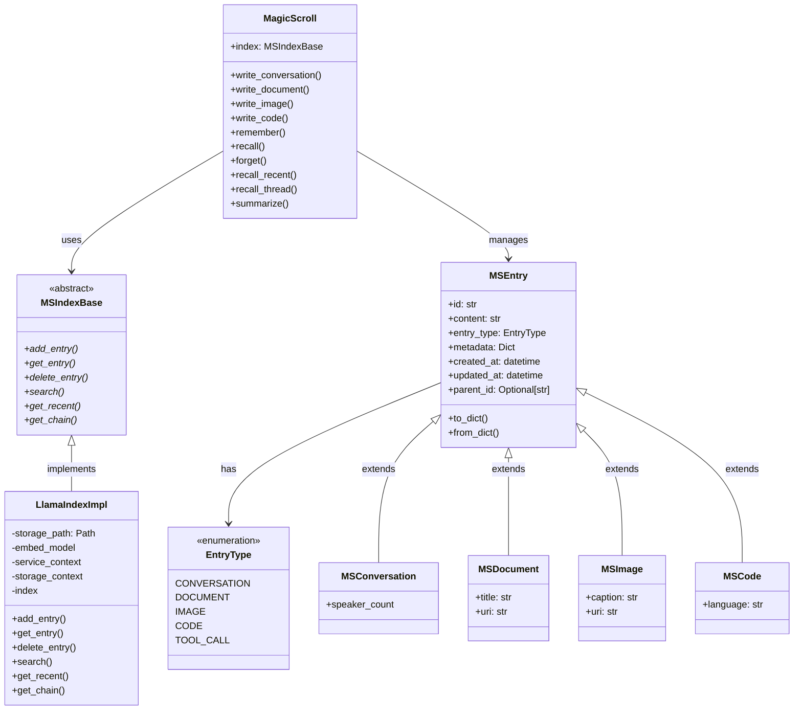
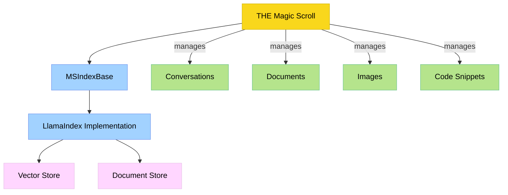

# Magic Scroll Architecture

This visualization shows:
1. The hierarchical relationship between components
2. The abstract index interface and its implementation
3. The various types of entries
4. How everything connects through the MagicScroll

The class diagram shows the detailed structure, while the flow diagram shows the conceptual organization. Both diagrams together give a complete picture of THE scroll that rules them all! 📜✨

Would you like me to:
1. Add more detail to any part of the diagrams?
2. Create additional diagrams showing other aspects?
3. Add sequence diagrams for specific operations?