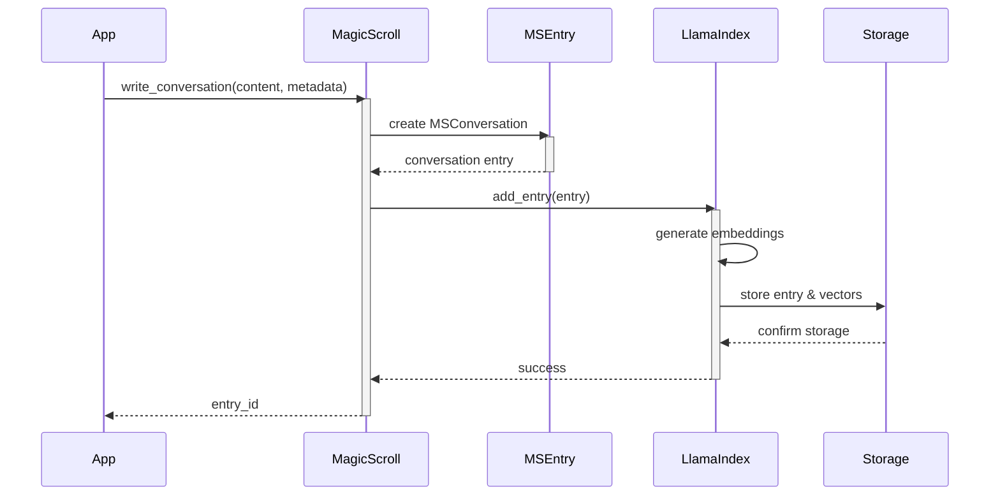
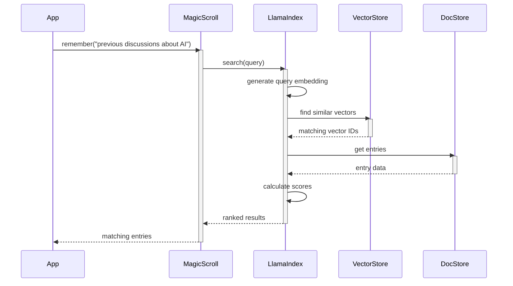
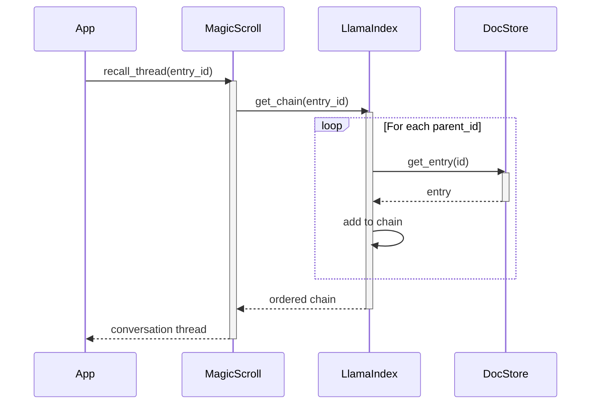
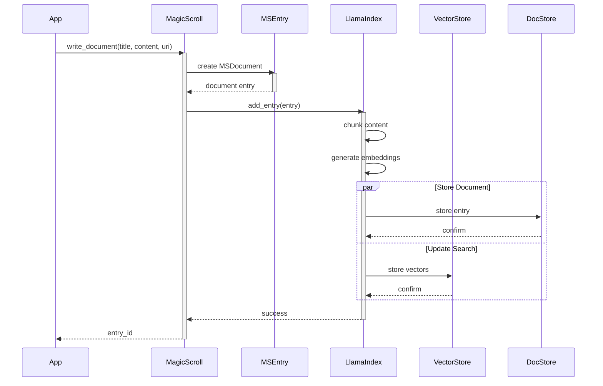

# Magic Scroll Sequence Diagrams

## Writing a Conversation

## Remembering (Searching)

## Recalling a Thread

## Adding a Document with Search Update

These sequence diagrams show:
1. The flow of data between components
2. Parallel operations where applicable
3. Activation/deactivation of different components
4. The asynchronous nature of operations

Would you like to see:
1. More complex scenarios?
2. Error handling sequences?
3. Other specific operations?