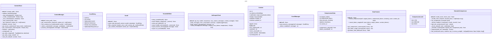

```mermaid
---
title: core
---
classDiagram
    class ContextStore {
        - __init__(self, storage_path) None
        + validate_timestamps(self)
        - _load_metadata(self) Dict[str, Any]
        - _create_metadata(self) Dict[str, Any]
        - _save_metadata(self, metadata) None
        - _load_contexts(self) None
        - _get_chain(self, context_id) List[Context]
        + add(self, context) None
        + get_recent_contexts(self, hours, limit) List[Context]
        + get_conversation_summary(self) Dict[str, Any]
        + list(self) List[Context]
        + reindex(self) int
        + get_date_range(self) Tuple[datetime, datetime]
        + get_date_range_str(self) str
        + add_with_full(self, context) None
    }

    class ContextManager {
        - __init__(self, store_path) None
        + get_conversation_chain(self, context_id) List[Context]
        + find_contexts_by_timeframe(self, query) List[Context]
        + select_contexts(self, message, candidates) List[Context]
        + process_message(self, message) List[Context]
    }

    class ScrollEntry {
        + UUID id
        + str content
        + Optional[str] model
        + datetime timestamp
        + Dict[str, Any] metadata
        + Optional[UUID] parent_id
    }

    class Scroll {
        - __init__(self) None
        + async add_entry(self, content, model, metadata) ScrollEntry
        + filter_view(self, models, since, until, context_id) List[ScrollEntry]
        - _get_context_thread(self, context_id) List[ScrollEntry]
    }

    class ScrambleMixin {
        + setup_scramble(self) None
        + async display_output(self, _content) None
        + async get_input(self) str
        + async handle_command(self, _command) None
        + async process_message(self, message) None
        + async run_scramble(self) None
    }

    class AnthropicClient {
        - __init__(self, api_key, model, compressor, max_context_messages, context_manager) None
        - _build_messages_from_context(self, contexts) List[MessageParam]
        - _build_system_message(self, contexts) str
        + send_message(self, message, contexts, max_tokens, temperature) Dict[str, Any]
    }

    class Context {
        + str id
        + np.ndarray embeddings
        + List[Dict[str, Any]] compressed_tokens
        + Dict[str, Any] metadata
        + datetime created_at
        + datetime updated_at
        - __eq__(self, other)
        - __hash__(self)
        + text_content(self) str
        + size(self) int
        + token_count(self) int
        + parent_id(self) Optional[str]
        + summary(self) str
    }

    class ScrollManager {
        - __init__(self) None
        + async process_message(self, message) ScrollEntry
        - _detect_model(self, message) str
    }

    class CompressionStats {
        + int original_tokens
        + int compressed_tokens
        + float semantic_similarity
        + datetime timestamp
        + str context_id
        + compression_ratio(self) float
        + tokens_saved(self) int
    }

    class StatsTracker {
        - __init__(self) None
        + record_compression(self, original_tokens, compressed_tokens, similarity_score, context_id) None
        + record_token_usage(self, input_tokens, output_tokens, context_tokens) None
        + get_compression_summary(self, hours) Dict
        + get_token_usage_summary(self, hours) Dict
        + generate_stats_table(self, hours) Table
    }

    class CompressionLevel {
        + dict LOW
        + dict MEDIUM
        + dict HIGH
    }

    class SemanticCompressor {
        - __init__(self, model_name, chunk_size) None
        - _handle_short_text(self, cleaned_lines) List[Dict[str, Any]]
        + set_compression_level(self, level)
        - _should_combine_chunks(self, chunk1, chunk2) bool
        + split_into_sentences(self, text) List[str]
        - _chunk_text(self, text) List[Dict[str, Any]]
        - _calculate_similarity(self, original_text, compressed_text) float
        + compress(self, text, metadata) Context
        + find_similar(self, query, contexts, top_k, recency_weight) List[tuple[Context, float, Dict[str, Any]]]
    }
```
