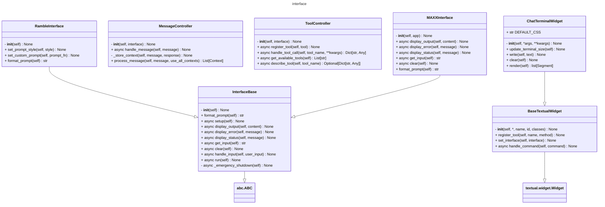

```mermaid
---
title: interface
---
classDiagram
    class RambleInterface {
        - __init__(self) None
        + set_prompt_style(self, style) None
        + set_custom_prompt(self, prompt_fn) None
        + format_prompt(self) str
    }

    class MessageController {
        - __init__(self, interface) None
        + async handle_message(self, message) None
        - _store_context(self, message, response) None
        + process_message(self, message, use_all_contexts) List[Context]
    }

    class InterfaceBase {
        - __init__(self) None
        + format_prompt(self) str
        + async setup(self) None
        + async display_output(self, content) None
        + async display_error(self, message) None
        + async display_status(self, message) None
        + async get_input(self) str
        + async clear(self) None
        + async handle_input(self, user_input) None
        + async run(self) None
        - async _emergency_shutdown(self) None
    }

    class ToolController {
        - __init__(self, interface) None
        + async register_tool(self, tool) None
        + async handle_tool_call(self, tool_name, **kwargs) Dict[str, Any]
        + async get_available_tools(self) List[str]
        + async describe_tool(self, tool_name) Optional[Dict[str, Any]]
    }

    class MAXXInterface {
        - __init__(self, app) None
        + async display_output(self, content) None
        + async display_error(self, message) None
        + async display_status(self, message) None
        + async get_input(self) str
        + async clear(self) None
        + format_prompt(self) str
    }

    class BaseTextualWidget {
        - __init__(self, *, name, id, classes) None
        + register_tool(self, name, method) None
        + set_interface(self, interface) None
        + async handle_command(self, command) None
    }

    class ChatTerminalWidget {
        + str DEFAULT_CSS
        - __init__(self, *args, **kwargs) None
        + update_terminal_size(self) None
        + write(self, text) None
        + clear(self) None
        + render(self) list[Segment]
    }

    RambleInterface --|> InterfaceBase

    InterfaceBase --|> `abc.ABC`

    MAXXInterface --|> InterfaceBase

    BaseTextualWidget --|> `textual.widget.Widget`

    ChatTerminalWidget --|> BaseTextualWidget
```
