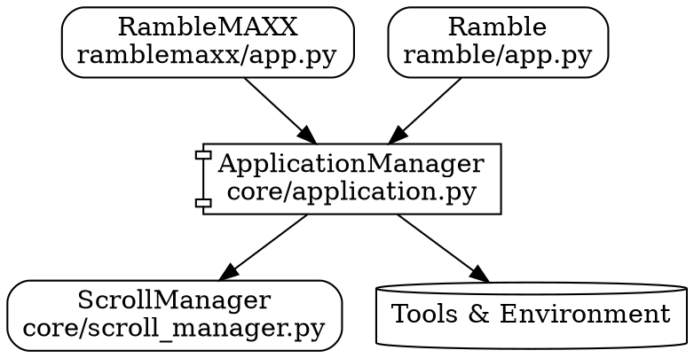

# Interface Cluster Architecture

The ApplicationManager becomes the single source of truth for:
1. How apps talk to the scroll system
2. What capabilities are available
3. How tools are exposed
4. What UI elements exist

Everything goes through this one coordinator. Each app just needs to know how to talk to the ApplicationManager, and the ApplicationManager handles everything else.

Is this closer to what you were thinking? We could refine the name - maybe InterfaceCoordinator or UIManager might be more descriptive?