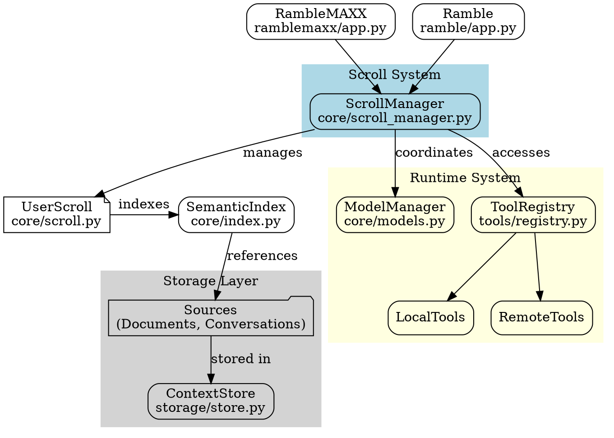

```graphviz
digraph G {
    rankdir=TB;
    node [shape=box, style=rounded];
    
    // Core scroll components
    subgraph cluster_scroll {
        label = "Scroll System";
        style = filled;
        color = lightblue;
        
        user_scroll [label="UserScroll\ncore/scroll.py", shape=note];
        scroll_manager [label="ScrollManager\ncore/scroll_manager.py"];
        semantic_index [label="SemanticIndex\ncore/index.py"];
    }
    
    // Storage system
    subgraph cluster_storage {
        label = "Storage Layer";
        style = filled;
        color = lightgrey;
        
        sources [label="Sources\n(Documents, Conversations)", shape=folder];
        context_store [label="ContextStore\nstorage/store.py"];
    }
    
    // Models and tools
    subgraph cluster_runtime {
        label = "Runtime System";
        style = filled;
        color = lightyellow;
        
        model_manager [label="ModelManager\ncore/models.py"];
        tool_registry [label="ToolRegistry\ntools/registry.py"];
        local_tools [label="LocalTools"];
        remote_tools [label="RemoteTools"];
    }
    
    // User interfaces
    subgraph cluster_interfaces {
        label = "User Interfaces";
        style = filled;
        color = lightgreen;
        
        maxx [label="RambleMAXX\nramblemaxx/app.py"];
        ramble [label="Ramble\nramble/app.py"];
    }
    
    // Key relationships
    user_scroll -> semantic_index [label="indexes"];
    semantic_index -> sources [label="references"];
    sources -> context_store [label="stored in"];
    
    scroll_manager -> user_scroll [label="manages"];
    scroll_manager -> model_manager [label="coordinates"];
    scroll_manager -> tool_registry [label="accesses"];
    
    tool_registry -> local_tools;
    tool_registry -> remote_tools;
    
    maxx -> scroll_manager;
    ramble -> scroll_manager;
    
    // Invisible edges for layout
    {rank=same; maxx; ramble}
    {rank=same; user_scroll; semantic_index}
}
```
