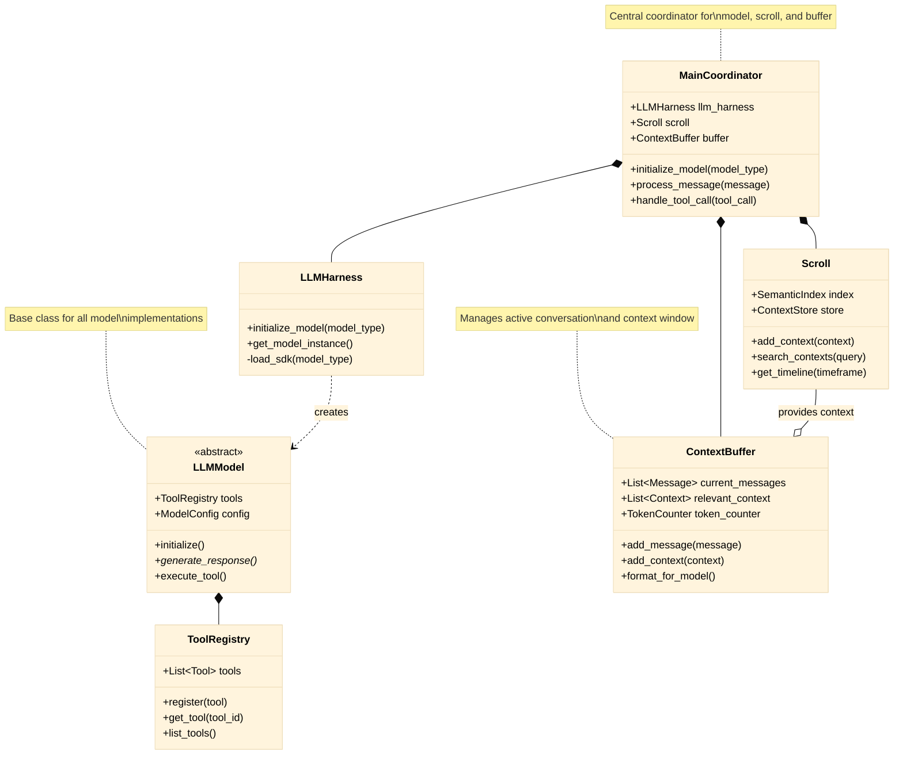

```mermaid
%%{init: { 'theme': 'base', 'themeVariables': { 'fontFamily': 'arial', 'fontSize': '16px', 'primaryTextColor': '#000000' } }}%%
classDiagram
    class MainCoordinator {
        +LLMHarness llm_harness
        +Scroll scroll
        +ContextBuffer buffer
        +initialize_model(model_type)
        +process_message(message)
        +handle_tool_call(tool_call)
    }

    class LLMHarness {
        +initialize_model(model_type)
        +get_model_instance()
        -load_sdk(model_type)
    }

    class LLMModel {
        <<abstract>>
        +ToolRegistry tools
        +ModelConfig config
        +initialize()
        +generate_response()*
        +execute_tool()
    }

    class ContextBuffer {
        +List~Message~ current_messages
        +List~Context~ relevant_context
        +TokenCounter token_counter
        +add_message(message)
        +add_context(context)
        +format_for_model()
    }

    class Scroll {
        +SemanticIndex index
        +ContextStore store
        +add_context(context)
        +search_contexts(query)
        +get_timeline(timeframe)
    }

    class ToolRegistry {
        +List~Tool~ tools
        +register(tool)
        +get_tool(tool_id)
        +list_tools()
    }

    MainCoordinator *-- LLMHarness
    MainCoordinator *-- Scroll
    MainCoordinator *-- ContextBuffer
    LLMHarness ..> LLMModel : creates
    LLMModel *-- ToolRegistry
    Scroll --o ContextBuffer : provides context

    note for MainCoordinator "Central coordinator for\nmodel, scroll, and buffer"
    note for ContextBuffer "Manages active conversation\nand context window"
    note for LLMModel "Base class for all model\nimplementations"
```