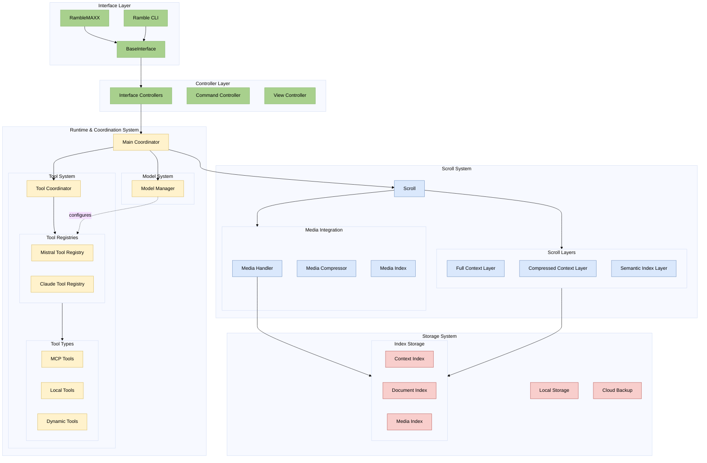

```mermaid
%%{init: { 'theme': 'base', 'themeVariables': { 'fontFamily': 'arial', 'fontSize': '16px', 'primaryTextColor': '#000000' } }}%%
graph TB
    %% Styling
    classDef interface fill:#a8d08d,stroke:#82b366,color:#000000
    classDef coordinator fill:#fff2cc,stroke:#d6b656,color:#000000
    classDef core fill:#dae8fc,stroke:#6c8ebf,color:#000000
    classDef storage fill:#f8cecc,stroke:#b85450,color:#000000

    %% Interface Layer
    subgraph interfaces[Interface Layer]
        Maxx[RambleMAXX]:::interface
        Ramble[Ramble CLI]:::interface
        BaseInterface[BaseInterface]:::interface
    end

    %% Controller Layer
    subgraph controllers[Controller Layer]
        InterfaceControllers[Interface Controllers]:::interface
        CommandController[Command Controller]:::interface
        ViewController[View Controller]:::interface
    end

    %% Runtime & Coordination System
    subgraph runtime[Runtime & Coordination System]
        direction TB
        MainCoordinator[Main Coordinator]:::coordinator
        
        subgraph model_sys[Model System]
            ModelManager[Model Manager]:::coordinator
        end
        
        subgraph tool_sys[Tool System]
            ToolCoordinator[Tool Coordinator]:::coordinator
            subgraph tool_registries[Tool Registries]
                MistralTools[Mistral Tool Registry]:::coordinator
                ClaudeTools[Claude Tool Registry]:::coordinator
            end
            subgraph tool_types[Tool Types]
                MCPTools[MCP Tools]:::coordinator
                LocalTools[Local Tools]:::coordinator
                DynamicTools[Dynamic Tools]:::coordinator
            end
        end
    end

    %% Scroll System
    subgraph scroll[Scroll System]
        ScrollClass[Scroll]:::core
        
        subgraph layers[Scroll Layers]
            direction TB
            FullContext[Full Context Layer]:::core
            CompressedContext[Compressed Context Layer]:::core
            SemanticIndex[Semantic Index Layer]:::core
        end
        
        subgraph media[Media Integration]
            MediaHandler[Media Handler]:::core
            MediaCompressor[Media Compressor]:::core
            MediaIndex[Media Index]:::core
        end
    end

    %% Storage System
    subgraph storage[Storage System]
        LocalStore[Local Storage]:::storage
        CloudBackup[Cloud Backup]:::storage
        
        subgraph indexes[Index Storage]
            ContextIndex[Context Index]:::storage
            DocumentIndex[Document Index]:::storage
            MediaIndex2[Media Index]:::storage
        end
    end

    %% Relationships
    Maxx & Ramble --> BaseInterface
    BaseInterface --> InterfaceControllers
    InterfaceControllers --> MainCoordinator
    MainCoordinator --> ModelManager
    MainCoordinator --> ToolCoordinator
    MainCoordinator --> ScrollClass
    ToolCoordinator --> tool_registries
    tool_registries --> tool_types
    ScrollClass --> layers
    ScrollClass --> media
    MediaHandler --> indexes
    layers --> indexes
    ModelManager -.->|configures| tool_registries
```