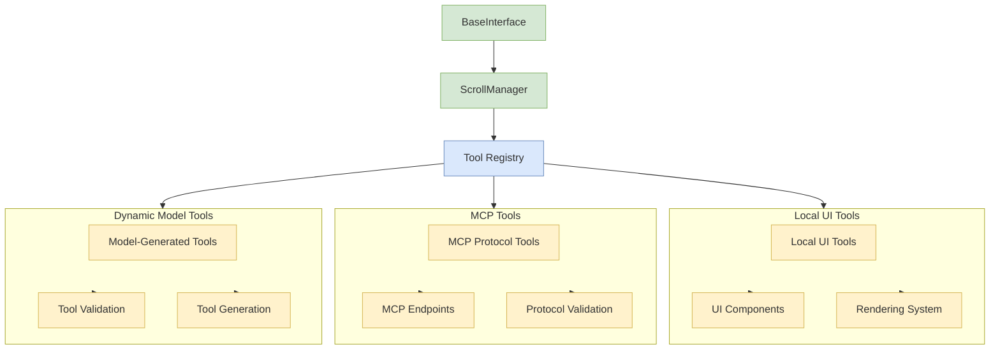

```mermaid
graph TB
    %% Styling
    classDef tool fill:#fff2cc,stroke:#d6b656
    classDef registry fill:#dae8fc,stroke:#6c8ebf
    classDef interface fill:#d5e8d4,stroke:#82b366

    %% Tool Registry
    Registry[Tool Registry]:::registry

    %% Tool Types
    subgraph local[Local UI Tools]
        LocalUI[Local UI Tools]:::tool
        UIComponents[UI Components]:::tool
        Rendering[Rendering System]:::tool
    end

    subgraph mcp[MCP Tools]
        MCPTools[MCP Protocol Tools]:::tool
        MCPEndpoints[MCP Endpoints]:::tool
        MCPValidation[Protocol Validation]:::tool
    end

    subgraph dynamic[Dynamic Model Tools]
        ModelTools[Model-Generated Tools]:::tool
        Validation[Tool Validation]:::tool
        Generation[Tool Generation]:::tool
    end

    %% Interfaces
    BaseInterface[BaseInterface]:::interface
    ScrollManager[ScrollManager]:::interface

    %% Relationships
    BaseInterface --> ScrollManager
    ScrollManager --> Registry
    Registry --> local & mcp & dynamic
    local --> UIComponents
    local --> Rendering
    mcp --> MCPEndpoints
    mcp --> MCPValidation
    dynamic --> Validation
    dynamic --> Generation
```